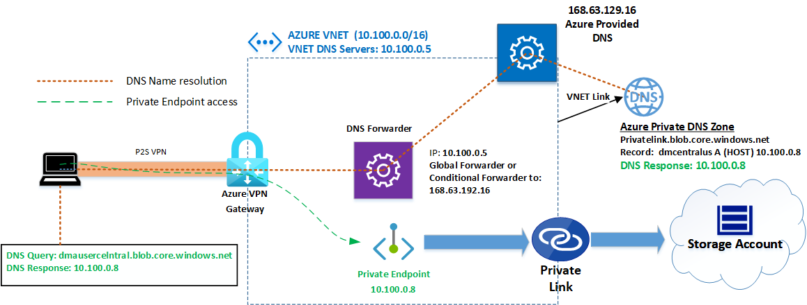
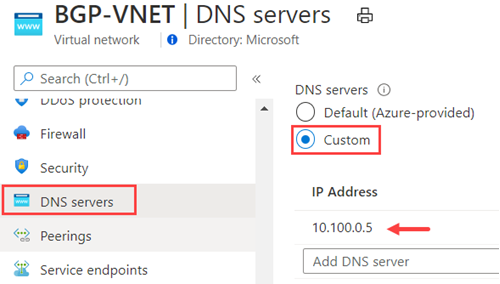
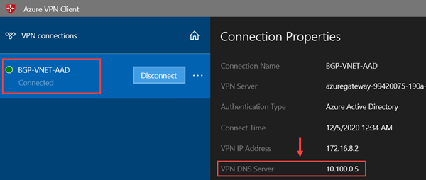
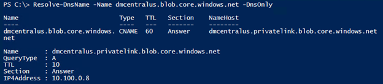
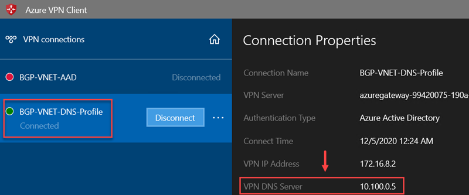
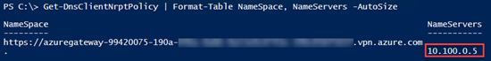

# Private Endpoint DNS integration over Point to Site VPN connection

## Introduction
In this post we are going on details on how to make Private Endpoint DNS name resolution work properly over point to site (P2S) VPN connections using Azure Virtual Network VPN Gateway or Virtual WAN VPN Gateway.

## Assumptions and requirements

This scenario assumes that you are hosting Private Link PaaS Zone in Azure Private DNS zone, for example: privatelink.blob.core.windows.net used for Azure Blob Storage Account.
Also it requires that you have a DNS Forwarder or Proxy to reach respective PaaS Private Link zone. 

In order to P2S VPN clients be able to resolve Private Endpoint entries hosted on Azure Private DNS Zones you must leverage an existing DNS Server (Forwarder or Proxy) or deploy one IaaS VM using a DNS Server role. That is required to P2S VPN clients be able to consume Azure Private DNS Zone which is exposed to 168.63.129.16 via DNS Forwarder/Proxy.

:point_right **Note:** this article has been validated with [Azure VPN Client](https://www.microsoft.com/en-us/p/azure-vpn-client/9np355qt2sqb?activetab=pivot:overviewtab) at the time of this writing and other VPN clients such and it hasn’t been validated with IPSec/IKE VPN Client (Native Windows 10) or OpenVPN Client. 

## Point to Site VPN name resolution behavior

By design Azure VPN client will set and use DNS servers that are either set on Virtual Network DNS Server or specified in client XLM profile. In case your Virtual Network is set to use Azure Provided DNS (168.63.129.16) you will not be able to resolve Private Endpoint. In case you don’t want to define DNS at the VNET level you can still set DNS Server configuration directly on client XLM profile and set the IP to a DNS Forwarder/Proxy running on Azure. As stated on previous session a DNS Forwarder/Proxy is required to P2S VPN clients be able to resolve endpoints.
Another very important consideration when you validating this solution is to know that **nslookup** is not the right tools to make the private endpoint name resolution validation over P2S VPN connections. Windows 10 has a feature called [Network Resolution Policy Table](https://docs.microsoft.com/en-us/previous-versions/windows/it-pro/windows-server-2012-R2-and-2012/dn593632(v=ws.11)) (NRPT) and VPN connections will add DNS information inside NRPT. Nslookup is not aware of NPTR and you must use PowerShell **Resolve-DNSName** cmdlet to check name resolution over VPN connection is working properly (see examples below of how to do proper name resolution validations).

## Solution

Below is diagram with the DNS name resolution flow from P2S VPN connection. The solution is broken down in two solutions where in first configuration is set DNS Server IP (Forwarder/Proxy) on VNET DNS settings, which is the easiest way to implement, and second solution is to specific DNS Server settings directly on Azure VPN client XML profile. The main reason to break down is two solutions is because having DNS settings at the VNET level does not affect only P2S VPN clients but also all resources deployed inside the VNET. Therefore, you may have the flexibility only to set that setting over Client VPN XLM profile to only be used by those remote user VPN connections instead of affecting also resources deployed inside the VNET.



### Solution 1: Defined DNS Server on Virtual Network

Specify DNS Setting at the VNET level as shown:



After you save the settings above you a reconnected on Azure VPN Client will trigger it to learn DNS Server settings specified at VNET level as shown:



**Name Resolution Validation**

Use PowerShell command: 

**Resolve-DnsName -Name *["Blob storage account FQDN name"]* -DnsOnly**

For example, using storage account name is: dmcentralus.blob.core.windows.net output is:



In case you run **nslookup** will bring storage account Public IP as output because it does not support NRPT feature.

### Solution 2: Specify DNS Server on Client VPN Profile
Download VPN Client profile to your computer and add DNS settings. Detailed steps can also be found in  How do I add custom DNS servers to the VPN client? 
In my example I have added the following entries on Azure VPN Client XLM profile:

```XLM
  <clientconfig>
	<dnsservers>
		<dnsserver>10.100.0.5</dnsserver>
	</dnsservers>
</clientconfig>
```

Now XLM profile can be imported on Azure VPN Client and here is an example how it going to look like after VPN connection:



**Validation**

Same validation can be done using solution one by using:

**Resolve-DnsName -Name *["Blob storage account FQDN name"]* -DnsOnly**

### Dump NRPT configuration

In case you want to see NRTP VPN client setting, run Powershell command:

**Get-DnsClientNrptPolicy | Format-Table NameSpace, NameServers -AutoSize**


