Private Endpoint DNS Integration Scenarios
==========================================

Table of Contents
=================

1. [Introduction](https://github.com/dmauser/PrivateLink/tree/master/DNS-Integration-Scenarios#1-introduction)

2. [How DNS resolution works before and after Private Endpoints](https://github.com/dmauser/PrivateLink/tree/master/DNS-Integration-Scenarios#2-how-dns-resolution-works-before-and-after-private-endpoints)

    2.1. [Before Private Endpoint](https://github.com/dmauser/PrivateLink/tree/master/DNS-Integration-Scenarios#21-before-private-endpoint)

    2.2. [After Private Endpoint](https://github.com/dmauser/PrivateLink/tree/master/DNS-Integration-Scenarios#22-after-private-endpoint)

3. [Azure Virtual Network DNS integration](https://github.com/dmauser/PrivateLink/tree/master/DNS-Integration-Scenarios#3-azure-virtual-network-dns-integration)

    3.1. [Private DNS resolution within the VNET](https://github.com/dmauser/PrivateLink/tree/master/DNS-Integration-Scenarios#31-private-dns-resolution-within-the-vnet)

    3.2. [Private DNS resolution between VNETs](https://github.com/dmauser/PrivateLink/tree/master/DNS-Integration-Scenarios#32-private-dns-resolution-between-vnets)

    3.3. [Private DNS resolution with Custom DNS inside the VNET](https://github.com/dmauser/PrivateLink/tree/master/DNS-Integration-Scenarios#33-private-dns-resolution-with-custom-dns-inside-the-vnet)

4. [On-Premises DNS integration](https://github.com/dmauser/PrivateLink/tree/master/DNS-Integration-Scenarios#4-on-premises-dns-integration)

    4.1. [Azure DNS Private Resolver - Preview](#41-azure-dns-private-resolver-preview)

    4.2. [Custom DNS Server](#42-custom-dns-server)

    4.3. [On-premises DNS Server conditional forwarder considerations](#43-on-premises-dns-server-conditional-forwarder-considerations)

5. [Architecture Design Example](https://github.com/dmauser/PrivateLink/tree/master/DNS-Integration-Scenarios#5-architecture-design-example)

6. [Conclusion](https://github.com/dmauser/PrivateLink/tree/master/DNS-Integration-Scenarios#6-conclusion)

7. [Appendix A - Validating DNS resolution](https://github.com/dmauser/PrivateLink/tree/master/DNS-Integration-Scenarios#7-appendix-a---validating-dns-resolution)

    7.1. [Before Private Endpoint](https://github.com/dmauser/PrivateLink/tree/master/DNS-Integration-Scenarios#71-before-private-endpoint)

    7.2. [After Private Endpoint (External Name Resolution)](https://github.com/dmauser/PrivateLink/tree/master/DNS-Integration-Scenarios#72-after-private-endpoint-external-name-resolution)

    7.3. [After Private Endpoint (Internal Name Resolution)](https://github.com/dmauser/PrivateLink/tree/master/DNS-Integration-Scenarios#73-after-private-endpoint-internal-name-resolution)

    7.4. [Server Name Indication (SNI) on TLS Request (Client Hello)](https://github.com/dmauser/PrivateLink/tree/master/DNS-Integration-Scenarios#74-server-name-indication-sni-on-tls-request-client-hello)

8. [Appendix B - Troubleshooting](https://github.com/dmauser/PrivateLink/tree/master/DNS-Integration-Scenarios#8-appendix-b---troubleshooting)

## 1. Introduction

Private Link and Private Endpoints has been a long-waited feature by Azure customers to allow fully private connectivity to Azure PaaS Services. By design, most of Azure PaaS services are public endpoints and other options have been offered to facilitate customers to secure their access to them such as [Virtual Network (VNET) Service Endpoints](https://docs.microsoft.com/en-us/azure/virtual-network/virtual-network-service-endpoints-overview) and [VNET Integration](https://docs.microsoft.com/en-us/azure/virtual-network/virtual-network-for-azure-services). However, Private Link/Endpoint offers a complete solution to access Azure PaaS Service fully private.

>For more information on PaaS architectures and related VNet integration patterns such as VNET Injection, Service Endpoints and Private Link click [here](https://github.com/fguerri/AzureVNetIntegrationPatterns).

Before we start to go in more DNS resolution process for Private Link and Private Endpoints, it is important to clarify important terminologies used in this article. First, that Private Endpoint represents **Service Consumer** side as well as where name resolution (DNS) is associated with. In other hand, Private Link represents **Service Provider** side which connects to a Private Endpoint to be properly accessed. If you are not familiar with Private Link and Private Endpoints please review official documentation at [http://aka.ms/privatelink](http://aka.ms/privatelink). Additionally, in Service Provider side there are three types of services that can exposed using Private Link: Azure PaaS Services, Partner Services and Customer Owned Services. This article will cover DNS integration scenarios for Private Endpoint when connecting via Private Link with Azure PaaS Services only and more specifically Azure Blob Storage Accounts to illustrate most of the examples and same logic can be applied to other PaaS services.

DNS integration has also different aspects to be enumerated when dealing with resolution inside Azure Virtual Network (VNET) versus On-Premises, and which one presenting its own considerations and challenges depending on customer's DNS usage footprint. Therefore, this article will be separated by: How DNS resolution works before and after private endpoint, Azure Virtual Network integrations and On-Premises DNS integrations scenarios with Private Endpoint. It is important to mention this content may not cover all scenarios, but it will go over the simplest implementation up to more complex ones which can give you an idea on how properly make your scenario to work with Private Endpoints. The first take away from document is to understand how DNS resolution works as well as how to assess DNS configuration for customers will help you to establish the best solution.

## 2. How DNS resolution works before and after Private Endpoints

First important step is to understand how DNS name resolution works before and after private endpoints. One point to clarify is access to name (full qualified domain name - FQDN) of the original PaaS Service has to be preserved for a fundamental reason, most access to PaaS services use secure TLS which requires SNI (Service Name Indication) which must be exact the same accessing either by Public or Private IP (this one after exposing it to Private Endpoint) which is mapped for specific instance. In our context here gbbstg1.blob.core.windows.net will be always used for initial request accessing that storage account. That also gives flexibility to have PaaS Service exposed to Internet and Internally via Private Endpoints without make any changes on the original name making user experience to be unique. For an illustration on how SNI plays an important role consult [Service Name Indication (SNI) on TLS Request (Client Hello)](https://github.com/dmauser/PrivateLink/tree/master/DNS-Integration-Scenarios#74-server-name-indication-sni-on-tls-request-client-hello) under Appendix A – Validating DNS resolution.

### 2.1. Before Private Endpoint

To illustrate what happens before expose PaaS Service such as a Storage Account to Private Endpoint (Review Appendix section where has been added few extra steps on how this validation can be done). This flow can be represented on the following Table where we see resolution sequence before Private Endpoint:

| **Seq** | **Name** | **Type** | **Record Value** |
| --- | --- | --- | --- |
| 1 | gbbstg1.blob.core.windows.net | CNAME | blob.sn1prdstr01a.store.core.windows.net |
| 2 | blob.sn1prdstr01a.store.core.windows.net | HOST (A) | 20.38.104.164 |

### 2.2. After Private Endpoint

After enabling Private Endpoint to the same Storage Account, **external resolution** resolves the same Public IP.

Name resolution sequence after Storage Account gbbstg1 get Private Endpoint enabled.

| **Seq** | **Name** | **Type** | **Record Value** |
| --- | --- | --- | --- |
| 1 | gbbstg1.blob.core.windows.net | CNAME | gbbstg1. **privatelink.blob.core.windows.net** |
| 2 | gbbstg1. **privatelink.blob.core.windows.net** | CNAME | blob.sn1prdstr01a.store.core.windows.net |
| 3 | blob.sn1prdstr01a.store.core.windows.net | HOST (A) | 20.38.104.164 |

However, there is a slight difference compared with the previous scenario that without Private Endpoint integration. When Private Endpoint is enabled, notice that Private Endpoint added an additional CNAME for the service: &quot; gbbstg1.privatelink.blob.core.windows.net&quot;.

A critical element for this scenario is to ensure the original name gbbstg1.blob.core.windows.net resolves to a customer&#39;s internal Private Endpoint IP for internal users, or the Public IP for external users if required. Therefore, when internal clients submit queries to internal DNS that is hosting **privatelink.blob.core.windows.net** they will be able to get internal IP. However, when external clients try to resolve the same name, the first redirect of privatelink domain will not be hosted in any external DNS Server, and it will make it fall back to the external CNAME blob.sn1prdstr01a.store.core.windows.net and finally get its public IP.

Here is the sequence when an internal DNS resolution happens considering **privatelink.blob.core.windows.net** zone has been properly configured with its respective HOST (A) records for Private Endpoint IP addresses:

| **Seq** | **Name** | **Type** | **Record Value** |
| --- | --- | --- | --- |
| 1 | gbbstg1.blob.core.windows.net | CNAME | gbbstg1. **privatelink.blob.core.windows.net** |
| 2 | gbbstg1. **privatelink.blob.core.windows.net** | HOST (A) | 10.0.0.5 |

**Note:** It is important not to override or host the original **blob.core.windows.net** as authoritative zone in your DNS Server. There is significant risk that resolution could fail for other important services that rely on resolving to a Public IP.

It is imperative also that you check the [http://aka.ms/privateendpointdns](http://aka.ms/privateendpointdns) which lists respective Private Link domains for each respective PaaS service. Keep in mind that some of PaaS Services such as Storage Accounts can also leverage sub resources such as blobs, table, queue, file, dfs and each one requires a dedicate Private Link domain zone.

Putting all together we have on the table below a summary of DNS name resolution behavior before and after enabling Private Endpoints as well as behaviors for resolution when queries are executed either on internal customer's network or external like Internet.

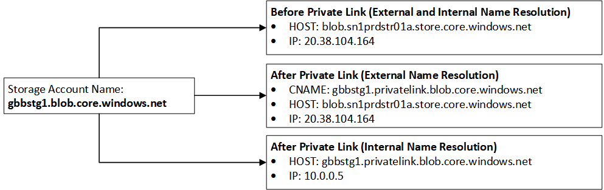

## 3. Azure Virtual Network DNS integration

There are a few options to consider when resolving DNS names within a VNET. Here are a few options you can leverage for name resolution:

1. Change HOST file on Azure IaaS VM in order have original PaaS name resolved original name. That is recommended for testing only.
2. Use Azure Private DNS Zones to host the privatelink zone. This is the recommended approach that will be described in detail later in this article.
3. Use Custom DNS zone to host privatelink sub-domain. This approach will not be explored in this article but customer will have to create and fully manage manually HOST (A) records under privatelink DNS zone as well as make sure that zone is can be resolved from other VNETs and On-Premises.

The first recommended step is to have it integrated with Azure Private DNS Zone to host privatelink DNS zone of respective service, in this case blob.core.windows.net zone. When creating the Private Endpoint, there is an option to integrate it with Private DNS as shown below:

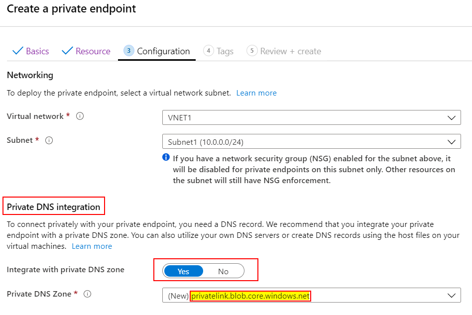

You can have your own privatelink zone in your DNS server or have a record integrated into Azure Private DNS. Private DNS is an easy way to centralize resolution information independent of the region since the service is a global resource. Design options will be covered later in this document.

The integration process to Azure Private DNS zone has some considerations for it to be used properly. Resources within the VNET must send DNS queries to Azure Provided DNS IP 168.63.129.16 ([What is IP address 168.63.129.16?](https://docs.microsoft.com/en-us/azure/virtual-network/what-is-ip-address-168-63-129-16)).

### 3.1. Private DNS resolution within the VNET

The process below details how a VM inside the VNET can access Storage Account via Private Endpoint. In that case because the VM uses Azure Provided DNS IP 168.63.129.16  (default setting on its NIC or VNET) same VM will be capable to resolve privatelink zone (in our case: privatelink.blob.core.windows.net) stored in Azure Private DNS zone.

A VM in the same VNET will be able to resolve the original storage account name (gbbstg1.blob.core.windows.net) to the appropriate private IP.  The Private DNS zone for privatelink.blob.core.windows.net was configured during the Private Endpoint creation. DNS resolution can be tested by levering PowerShell command _Resolve-DNSName_ to the record as shown:

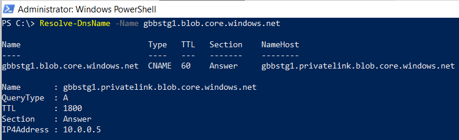

The diagram below provides more details on the DNS resolution flow when a VM in a VNET tries to resolve private endpoint:

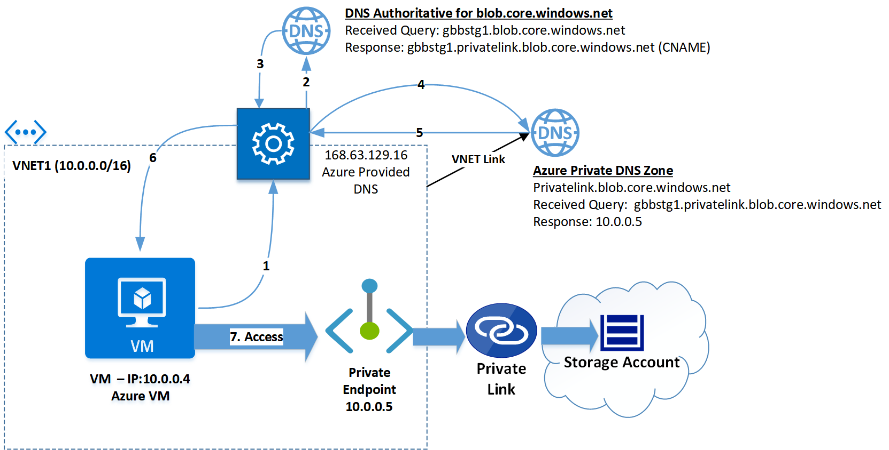

1. VM sends a DNS query asking for IP associated to **gbbstg1.blob.core.windows.net** to Azure Provided DNS 168.63.129.16.
2. Azure Provided DNS sends query to the authoritative DNS Server that hosts blob.core.windows.net zone and process it.
3. That authoritative DNS Server responds back to Azure provided DNS in the VNET that with the correct CNAME: **gbbstg1.privatelink.blob.core.windows.net.**
4. Azure Provided DNS is aware that Private DNS Zone hosts **privatelink.blob.core.windows.net** zone and can process as host name (A record) from gbbstg1 to its private endpoint IP 10.0.0.5.
5. Private DNS zone returns private endpoint IP back to Azure Provided DNS.
6. As final step Azure Provided DNS returns private endpoint IP back to the client.
7. The VM will now be able to access the Storage Account via Private Endpoint IP 10.0.0.5.

### 3.2. Private DNS resolution between VNETs

How about other VNETs that are peered with the VNET with private endpoint exposed?  That is one of main reason to leverage Azure Private DNS to facilitate resolution from other VNETs. The only requirement to make that work is to link VNET to the respective PaaS service domain zone, in our case Storage which is use privatelink.blob.core.windows.net domain resolve that properly as shown:

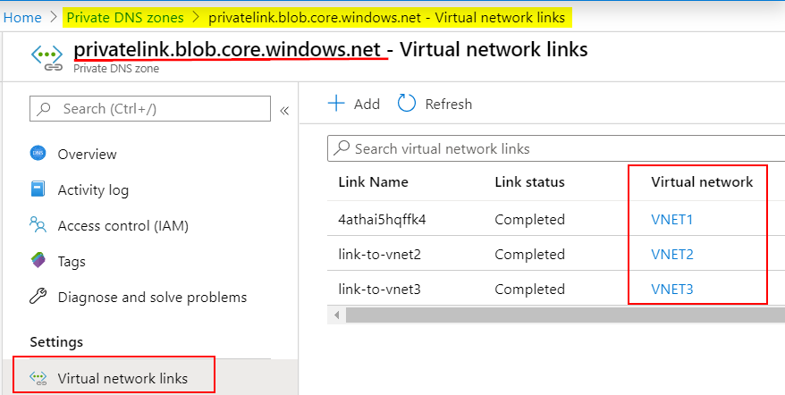

DNS resolution will work independently regardless if the VNETs are peered. In order to consume the Private Endpoint, the source VM will need to be able to talk to the VNET that owns the service through technologies such as VNET peering, VPN, Expressroute etc.

Another big advantage to leveraging Private Endpoint with Private DNS zones is any VNET can be linked independent of their region. Private DNS is a global resource and VNETs around the globe can link to this service.

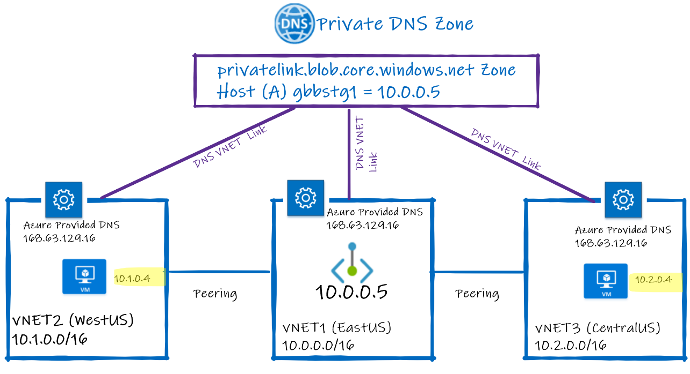

In diagram above we see two VMs (10.1.0.4 on left side and 10.2.0.4 on right-side) sitting on different VNETs (VNET2 and VNET3). Each VNET can resolve the Private Endpoint IP because they have explicit VNET links to Azure Private DNS zone hosting privatelink.blob.core.windows.net zone. Respective VMs send queries to 168.63.129.16 (Azure Provided DNS) and get private endpoint IP associated to gbbstg1 storage account 10.0.0.5 located on VNET1.

### 3.3. Private DNS resolution with Custom DNS inside the VNET

Another scenario to consider when integrating Private Endpoint with DNS is to know that Azure give customers flexibility to bring their own DNS Server to Azure. There are multiple reasons to have your own DNS Server in Azure, but that is outside of scope of this document. However, it is important to understand that we may have different behaviors when Custom DNS server is present in a VNET and how it is configured to work properly with Private DNS Zone and resolve PaaS services exposed via Private Endpoints.

To make custom DNS server to work properly on the VNET it is required to either specify the DNS server IP either on VNET level or NIC level as shown below. On the right side DNS Server is configured to use two Custom DNS server 10.0.0.10 (primary) and 10.0.0.11 (secondary). On the left side, NIC has DNS Server option to set to inheriting DNS settings from the VNET level.

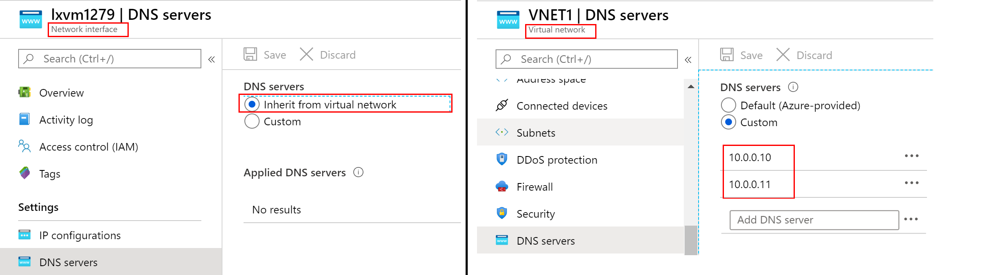

On this type of configuration, it is important be aware of scenarios that may impact how PaaS DNS FQDN original gbbstg1.blob.core.windows.net map to the associated Private Endpoint CNAME gbbstg1.privatelink.core.windows.net and the associated behavior:

#### a) Custom DNS Server forwards all unknown requests to Azure Provided DNS

In this scenario, we have a Custom DNS Server configured to forward to Azure Provided DNS IP 168.63.129.16:

Resolution will behave exactly as resolution of the VM had been pointed directly to the same IP 168.63.129.16.  The diagram above with the difference of an extra hop for the query (1) and response (8) going to Custom DNS Server.

#### b) Custom DNS Server forwards all unknown requests to another DNS Server/Root Hints

Another custom DNS scenario to consider is when a Forwarder or Root hints have a direct impact on how Private Endpoints get resolved. Here is a list of potential configurations you may see that and how you can work it around to get Private Endpoint resolved correctly.

- **Custom DNS Servers point to Root Hints Only** – This is rare scenario because pointing to Root Hints is not always efficient to resolve Internet names. The recommendation here is to have Azure Provided DNS (168.63.129.16) set as Forwarder and resolution will be exact as the one explained on previous section. Having that setup will make Private Endpoint work as expected with Private DNS zones.

- **Custom DNS Servers point to other DNS Server as Forwarders** – This scenario is common when customers want to make sure Custom DNS Servers don&#39;t have access directly to Internet for Name resolution. They may forward to other dedicated &quot;External DNS Servers&quot; in a dedicated Azure VNET which may use Internet DNS as a Forwarded and Root Hints as backup. ( **Note:** there is a similar scenario for OnPrem that will be covered in specific section on this document.) The easiest way to configure Custom DNS servers is to point them to Azure provided DNS (168.63.129.16). In case that is not possible, there are two potential workarounds:

  **(Workaround 1)** Target Azure DMZ DNS Forwarders used by Custom DNS Server should point to Azure Provided DNS (168.63.129.16) as Internet Forwarder. In case that the target DMZ DNS Forwarders are in dedicated VNET (DMZ) link that VNET to Azure Private DNS to make sure zone privatelink."PaaS domain name" (example: privatelink.blob.core.windows.net); can be leveraged. This scenario is easy to be implemented and less administrative effort because is targeted only on Azure DMZ DNS Servers.

  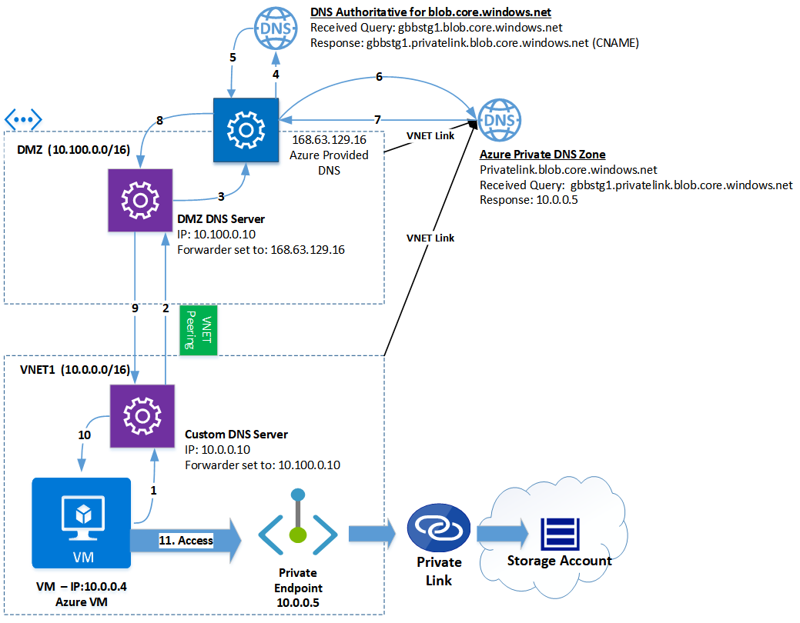

  **(Workaround 2)** Create a conditional forwarder on each Custom DNS Server to the original PaaS domain name (on Storage example, **blob.core.windows.net** ) and point it to Azure Provided DNS 168.63.129.16. As side note, redirecting to privatelink subdomain (on Storage example, **privatelink.blob.core.windows.net** )  it will not take any effect for this kind of scenario because final resolution will be always done at the final DMZ DNS Servers. In this case, keep in mind that all DNS requests with or without Private Endpoint will be send to those Custom DNS Server. This scenario is explained on the diagram below. You will see blob.core.windows.net Conditional Forwarder to 168.63.129.16 must be created to properly resolve Private Endpoint IP 10.0.0.5. The main reason for that is because custom DNS Server is configured to use another DNS server as forwarder (DMZ DNS Forwarder) which does not have any integration with Azure Provided DNS. That DNZ DNS points to an external DNS server or Root Hints or an On-prem DNS Server.
  
  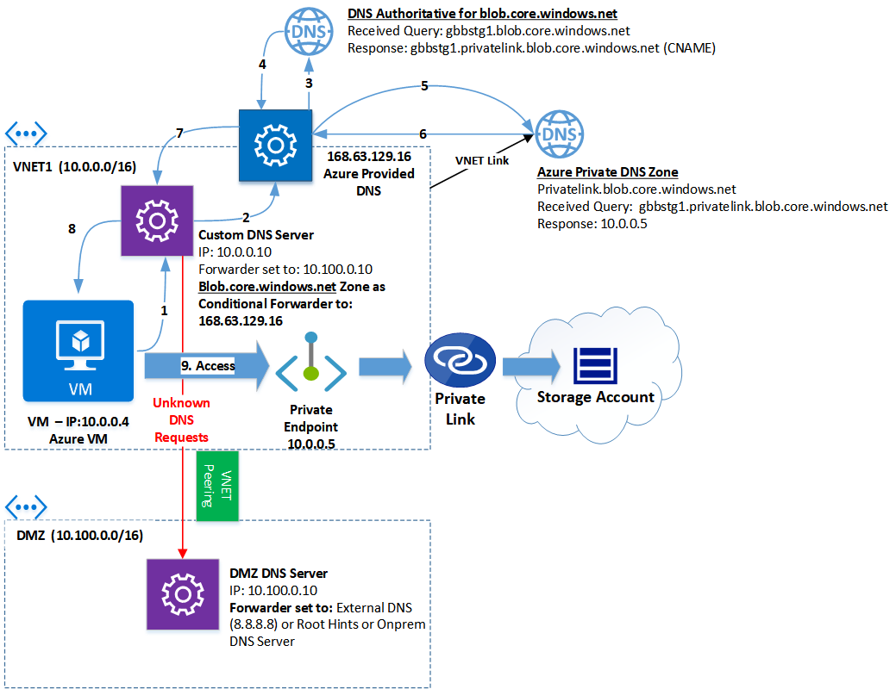

## 4. On-Premises DNS integration

Until recently the only way to reach Private DNS Zones hosting Private Link zones from On-premises DNS server were leveraging a custom DNS Server acting as proxy or forwarder in Azure. The main reason for that behavior is Azure Private DNS zones that host private link zone are only reacheable using 168.63.129.16 ([What is IP address 168.63.129.16?](https://docs.microsoft.com/en-us/azure/virtual-network/what-is-ip-address-168-63-129-16)) but only Azure resources such as Virtual Machines or PaaS services are the only Azure components that can reach that IP. The main downside of this approach customer had to deploy or uses their existing IaaS VM with DNS role to act as proxy/forwarder and point the On-premises DNS server to that proxy/forwarder and from it access Azure Private DNS zones hosting Private Link zones using the IP 168.63.129.16.

Below on 4.1 we are going to explore the Azure Private Resolver which is a DNS Server first party solution to allow better integration with Azure Private DNS Zones. At the same time it is important to note that Customer DNS Server is still an valid option which will be covered on 4.2 section below.

### 4.1 Azure DNS Private Resolver (Preview)

Azure DNS Private Resolver is the newer first party offering to help customers to integrate better DNS resolution from On-premises to Azure, like facilitate integration from an On-premises DNS server to resolve domains hosted in Azure Private DNS zones like private link zones (privatelink.blog.core.windows) which is the scope of this article as well as allows Azure resources to resolve DNS names hosted On-premises.

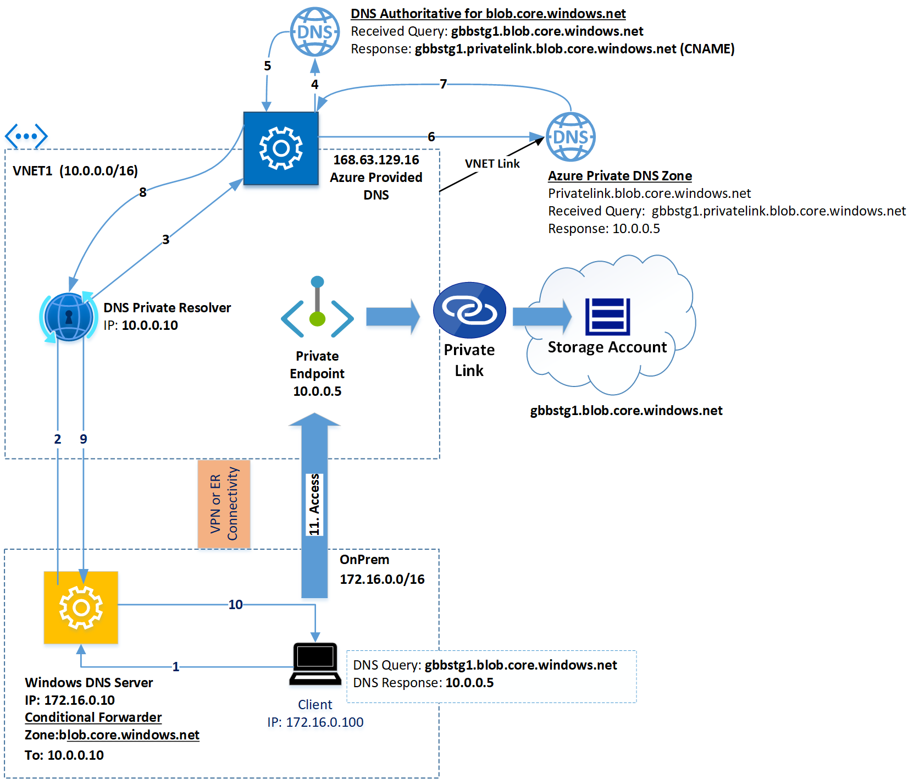

Above you can see the process of integration of Azure DNS Private resolver.
1. Client (172.16.0.100) sends a DNS query to gbbstg1.blob.core.windows.net
2. On-premises Windows DNS Server receives the query and process towards Azure (DNS Private resolver at 10.0.0.10) by leveraging the Conditional Forward zone: blob.core.windows.net.
3. DNS Private Resolver process the query and sends it to Azure Provided DNS. 
4. Because we have a public domain zone that query will be processed first by the Azure Public DNS which is authoritative to blob.core.windows.net. 
5. Because gbbstg1 storage account has private link integrated and CNAME gbbstg1.private.link.blob.core.windows will be the response.
6. Azure Private DNS zone is linked to the VNET1 and it will receive the query for the zone private.link.blob.core.windows.net 
7. That query will be process for the existing mapping A (host) record for gbbstg1.private.link.blob.core.windows.net mapped to the IP 10.0.0.5 and returned to the Azure Provided DNS.
8. That response is returned to the DNS Private Resolver.
9. And then will be forwarded back to the On-premises Windows DNS Server.
10. On-premises WindowsDNS Server will than return the final response to the Client.
11. Now the client has the proper private IP address associated and it will access the private endpoint 10.0.0.5 associated to the gbbstg1 storage account.

### 4.2 Custom DNS Server

On this scenario customer wants or has already a DNS Proxy or Forwarder solution in Azure. For example, that solution can be an Active Directory Domain Controller, Azure Active Dirctory Domain Services (AADDS), a 3rd party solution like Infoblox or Firewall host DNS solution like Azure Firewall and others like a NGINX DNS proxy forwarder ([Deploy VMSS of a NGINX DNS Proxy into an existing Virtual Network](https://github.com/Microsoft/PL-DNS-Proxy).)

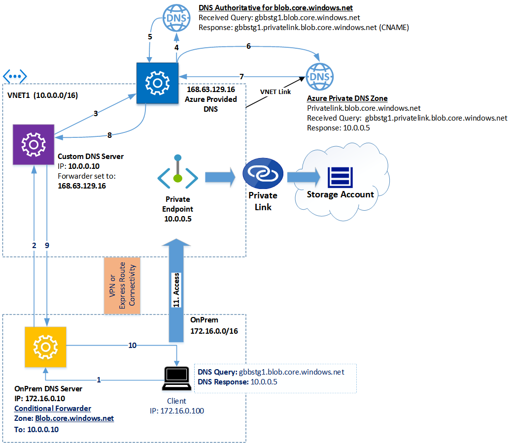

In case you have Custom DNS solution, you need to setup conditional forwarders on your OnPrem DNS server pointing to it.

As mentioned in the previous section when Custom DNS server are pointing to other DNS Servers as forwarders, similar name resolution challenges are going to be faced when dealing with On-premises DNS Servers to resolve Private Endpoints records stored in Azure Private DNZ Zone. Most of those challenges can be easily resolved by having your OnPrem DNS Server to use conditional forwarder for original PaaS name, example: blob.core.windows.net.  On next section, _Architecture Design Example_, there is a diagram that details name resolution flow from a OnPrem computer using OnPrem DNS Server with that setup (conditional forwarder to **blob.core.windows.net** ) pointing to the IP of Azure Custom DNS Server, and finally getting Azure Private DNS zone properly resolved when query is sent to 168.63.129.16. Also, on the same diagram you will see that Azure Custom DNS Server does not have to be located on the same VNET and where Private Endpoint exists but its VNET has to be linked to the same Azure DNS Private DNS Zone in order to process the name resolution properly.

### 4.3 On-premises DNS Server conditional forwarder considerations?

**Note**: _the behavior explained in this section has been observed over Windows DNS Server only. There are reports that BIND-based DNS Servers (including Infoblox) work using conditional forwarders towards the privatelink.PaaS-domain zone (example: privatelink.blob.core.windows.net for storage accounts) without any issues. Therefore, please validate in your environment before deciding between adding the privatelink .PaaS-domain zone (privatelink.blob.core.windows.net as an example for storage accounts) or the default PaaS zone (blob.core.windows.net). More details about this behavior to be added soon to this article._

On most of On-premises DNS servers fall on that category of they will have a forwarder setup to point to another DNS server in customer&#39;s DMZ or point to ISP DNS Servers. That is the most common scenario we see running on customers as shown below where the question raised is: Which zone should I configure Conditional Forwarders from my OnPrem DNS Server? The short answer it depends how your OnPrem DNS is configured. You may have an option to configure conditional forwarders to the PaaS domain zone or subdomain zone private link returned by the CNAME. In our context here for storage accounts that would be either blob.core.windows.net or privatelink.blob.core.windows.net. The short answer is conditional forwarder to blob.core.windows.net is the way to go because is easy to implement. The remain question is why setting up to privatelink.blob.core.windows.net may not work?

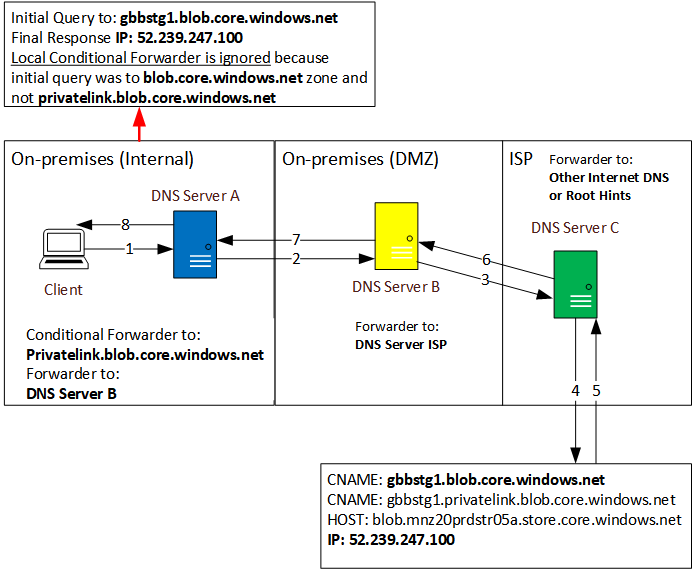

In the case above, we have DNS A located internally OnPrem Network and has a conditional forward to **privatelink.core.blob.windows.net**. DNS B sits on customer&#39;s Network and point to DNS C which is hosted on customer&#39;s ISP. The client sitting on OnPrem Network always must send the DNS query to the original PaaS Service, in our case **gbbstg1.blob.core.windows.net.** In this case what DNS A is going to do try to resolve domain:  **blob.core.windows.net** which is not hosted locally and does not match with the  **privatelink**  conditional forwarder. Because DNS A has DNS B set as forwarder, DNS A will send the initial query name **gbbstg1.blob.core.windows.net** to DNS B which is in the same situation, no local zone or matching conditional forwarder and then send it to the DNS C on ISP network. Because of the nature of recursive queries, the last DNS in the chain which is DNS C will make full resolution of **gbbstg1.blob.core.windows.net**. DNS C will get the first CNAME **gbbstg1.privatelink.blob.core.windows.net**. and which continue the resolution to the other public CNAME to  **blob.sn1prdstr01a.store.core.windows.net.**  The Public IP will be returned as the result exactly illustrated in the first section of this article. Therefore configured privatelink.core.windows.net conditional forwarder zone on DNS A it will be completely ignored.

The only possibility to conditional forwarder to **privatelink.core.blob.windows.net** work is if DNS A on the picture above does direct external resolution to Internet Root Hints, it will be able directly to get privatelink CNAME and able to process the local conditional forwarder.

The final key scenario to consider is how can an On-Premises DNS server can be properly configured to resolve PaaS names and return Private Endpoint IP. There are few options enumerated below that can give you flexibility on your implementation:

- **Solution 1** -  Conditional Forwarder to original PaaS domain name.     
    
    Example: Conditional Forwarder to: **blob.core.windows.net Pointing to IP: 10.0.0.10** (IP of Azure Custom DNS server).

    **Note 1:** You can add multiple destination IPs for the same Conditional Forwarder Zone for redundancy. Secondary Azure DNS Server IP for example. 
  
    **Note 2:** First diagram on this section (On-Premises DNS integration) is an illustration of this configuration.

  **Pros**:
    - Easy to implement.
    - Integration with Azure Private DNS Zones.
    - Centralized Record Management on Azure Private DNS.

  **Cons**:
    - All name resolution to PaaS Services will use this Conditional Forwarder and they will be redirected to Custom DNS server in Azure.

- **Solution 2** - Conditional Forwarder to Specific PaaS service FQDN using Private Endpoint pointing to custom DNS IP in Azure.

  Example: 
  Conditional Forwarder to: gbbstg1.blob.core.windows.net
  Pointing to IP: 10.0.0.10 (IP of Azure Custom DNS server).

  **Note**: You can add multiple destination IPs for the same Conditional Forwarder Zone for redundancy. Specifying a secondary Azure DNS Server IP, for example.

  **Pros**:
    - Only DNS traffic to specific PaaS Resource will be redirected to Azure.
    - Integration with Azure Private DNS Zones

  **Cons**:
    - Administrative overhead by creating a single Conditional Forward Zone for each PaaS FQDN.

- **Solution 3** - Local DNS Zone specifying FQDN PaaS Service using Private Endpoint IP as Host record.

  Example: 
  Local DNS Forward Lookup Zone to: gbbstg1.blob.core.windows.net.
  Add HOST (A) record entry to the IP of the Private Endpoint IP on Azure.
  
  **Pros**:
  - Higher control of DNS traffic because full DNS name resolution for private endpoint stays OnPrem.

  **Cons**:
  - No integration with Azure Private DNS Zones to resolve PaaS privatelink domain zone.
  - Higher administrative overhead to create and manage individual FQDN zones which can increase complexity based on how DNS works.
  - Scalability issues when large amount of DNS Servers is present. It can be resolved by one of these options: Zone replication (Active Directory), script automation, DNS Zone Transfer and others. 

## 5. Architecture Design Example

Here is sample design on how to integrate OnPrem DNS as well as Azure DNS resolution to PaaS Services and obtain Private Endpoint IP.

**Note:** The diagram illustrated on this section is just an example and not necessary applicable for your scenario. Therefore, extra adjustments might be necessary based on your requirements. Please check [Private Link resources repo](https://github.com/dmauser/PrivateLink) for other specific articles and design patterns.

On the diagram below we have Contoso corporation which has Private Endpoint resource spread across multiple Spoke VNETs (SPK1 and SPK2 on West US region and SPK3 and SPK4 VNETs on East US region). Because Private Endpoints exist on each one of the Spoke VNETs, Contoso has leveraged Azure Private DNS (Global Resource) and linked each one of the VNETs to Azure Private DNS. All Private Endpoints records have been successfully registered under privatelink.blob.core.windows.net and to allow name resolution for each Private endpoint resolve correctly.

**Note: (Azure Private DNS Resolver)** You can replace Custom DNS servers listed below with Azure DNS Private resolver and private link resolution will work in the same way when integrating with On-premises.

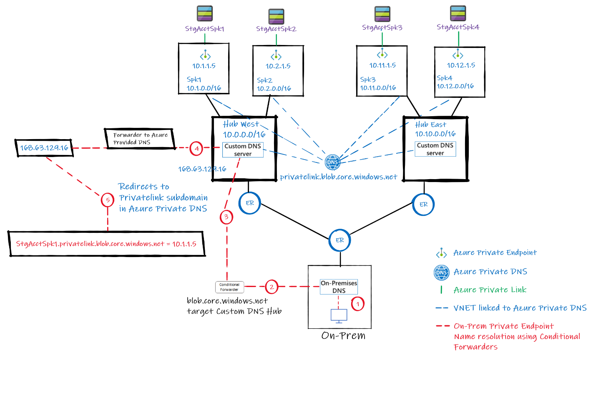

In order to make name resolution integration to OnPrem each one of the region has its own Hub (West and East) two Custom DNS Servers have been placed on each HUB for redundancy (note: diagram only reflects one custom DNS). Each HUB VNET has been linked to Azure Private DNS. Here is how a Client on OnPrem will get Private Endpoint IP back to access storage account StgAcctSpk1:

1. Client sends query to **StgAcctSpk1.blob.core.windows.net**
2. A conditional forwarder to: **blob.core.windows.net** pointing to both Custom DNS Servers in the HUB.

    **Note:** Most On-premises DNS Server has DNS Forwarders to a DNS in DMZ plus ISP (not shown in the diagram) which conditional forwarder to privatelink. **blob.core.windows.net not work as expected.** That is explained on On-premises DNS Integration section on this document.

3. Query is then redirect to Custom DNS Server on HUB VNET.
**Note:** For redundancy you can setup Conditional Forwarder in OnPrem DNS server to point to each Custom DNS server IP on it respective VNET as shown. Additionally, you can make Custom DNS Server high available by leveraging this VMSS DNS Proxy solution: [https://github.com/Microsoft/PL-DNS-Proxy](https://github.com/Microsoft/PL-DNS-Proxy)

4. Custom DNS Server on the HUB sends name query to use Aure Provided DNS (168.63.129.16) because is configured as DNS Forwarder.

5. Azure Provided DNS make the resolution to original request StgAcctSpk1.blob.core.windows.net to its respective DNS Server authoritative for the zone: blob.core.windows.net and returns CNAME: StgAcctSpk1.privatelink.blob.core.windows.net. Because we have VNET linked to Azure Private DNZ Zone which host **privatelink.blob.core.windows.net** zone, private IP 10.1.1.5 is returned.

## 6. Conclusion

The intention of this document was to enumerate options and common scenarios when integrating Private Link/Endpoint with DNS name resolution. When planning that DNS integration with them there are few considerations that need to be taken in account and more than one solution is possible. Therefore, it is important to note that not all scenarios are covered here but the intention was to provide some insights on how that integration works as well as ensure you make proper tools to assess customer's current DNS scenario and  implement the solution that fit their needs to properly consume Private Link/Endpoint.

Other relevant resources can be found in [Private Link/Endpoint DNS Integration Resources](https://github.com/dmauser/PrivateLink).

## 7. Appendix A - Validating DNS resolution

To clarify better on how PaaS service DNS name resolution works when dealing with private endpoint works the following command _Resolve-DnsName_ can provide good details. In this section, storage account name: _gbbstg1.blob.core.windows.net_. will be used as an example:

Resolve-DnsName -Name gbbstg1.blob.core.windows.net

**Note:** Other tools such as DIG (Linux) or Nslookup (set debug) can accomplish the same exact task. Consider them as alternative for Powershell _Resolve-DnsName_ command.

### 7.1. Before Private Endpoint

First example shows resolution behavior before expose Storage Account gbbstg1 to Private Endpoint which is expected resolution in the same way for any PaaS Service following those lines. 

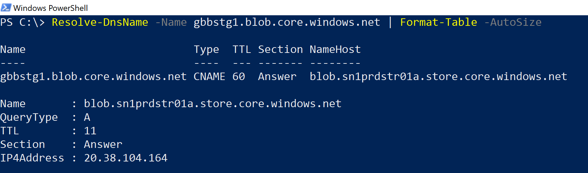

The above shows the exact order of resolution for the storage account gbbstg1 which will be redirected to CNAME. The CNAME represents the Storage front end which will be associated with a Host (A) records and result will be a public IP.

1. gbbstg1.blob.core.windows.net resolves to CNAME: blob.sn1prdstr01a.store.core.windows.net
2. blob.sn1prdstr01a.store.core.windows.net to Host (A) which returns Public IP: 20.38.104.164

### 7.2. After Private Endpoint (External Name Resolution)

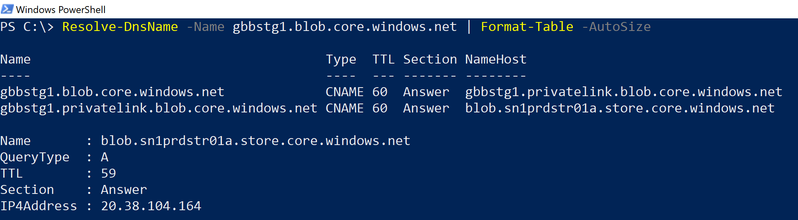

Screenshot below shows how name resolution changes after get PaaS service exposed to Private.

Endpoint external name resolution which shows new CNAME (first line) to private.link.blob.core.windows.net. of Storage Account before Private Endpoint. Because that resolution is initiated externally first CNAME will point to a second CNAME which then resolve which than resolves HOST (A) record and get public IP.

1. gbbstg1.blob.core.windows.net resolves to CNAME: gbbstg1.**privatelink.blob.core.windows.net**
2. gbbstg1.**privatelink**.blob.core.windows.net **points to CNAME**: blob.sn1prdstr01a.store.core.windows.net
3. blob.sn1prdstr01a.store.core.windows.net to Host (A) and returns Public IP: 20.38.104.164

### 7.3. After Private Endpoint (Internal Name Resolution)

Resolution inside customers network either (VNET or OnPrem) it will get desired Private Endpoint IP as shown below.

1. gbbstg1.blob.core.windows.net resolves to CNAME: gbbstg1.**privatelink.blob.core.windows.net**
2. gbbstg1.**privatelink.blob.core.windows.net is a Host (A)** and returns Private IP: 10.0.0.5

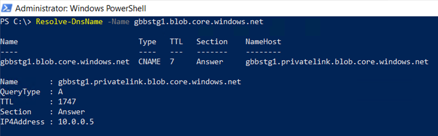

### 7.4. Server Name Indication (SNI) on TLS Request (Client Hello)

Here is a sample for network capture that show a Client (10.0.0.11) sending a request to storage account gbbstg1.blob.core.windows.net accessing it via Private Endpoint (destination IP 10.0.0.5). All requests to PaaS services must send original name, and any attempt to make a custom DNS name or sending request directly to **gbbstg1.privatelink.blob.core.windows.net** will fail. The network capture below shows TLS Client Hello (Frame 5144) sending original storage name and it will be accepted in sequence for Server Hello (Frame 5145):

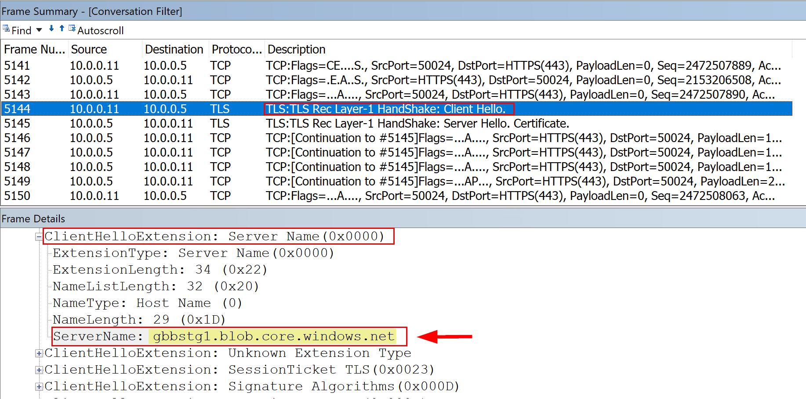

## 8. Appendix B - Troubleshooting

Here are few steps to resolve DNS issues when integrating private endpoint with Azure Private DNS:

1. Validate Private Endpoint has proper DNS record on Private DNS Zone. In case Private Endpoint was deleted and recreated a new IP may exist or duplicated records which will cause clients to use round-robin and make connectivity instable.
2. Validate if DNS settings of the Azure VM has Correct DNS Servers.
  
    a) DNS settings can be defined VNET level and NIC Level.
      
    b) DNS setting cannot be set inside Guest OS VM NIC.
3. For Custom DNS server defined check the following:
  
    Custom DNS Server forwards all requests to 168.63.129.16 (Microsoft recommendation)?
    
    **Yes** – you should be able to consume Azure Private DNS zones correctly.

    **No** – In that case you may need to create a conditional forwarder either to: privatelink zone or original PaaS Service Zone (check validation 4).

4. Custom DNS has:

    a) **DNS has Root Hits only** – In this case is the best to have a forwarder configured to 168.63.129.16 which will improve performance and doesn't require any extra conditional forwarding setting.

    b) **DNS Forwarders to another DNS Server (not Azure Provided DNS)** – In this case you need to create a conditional forwarder to original PaaS domain zone (i.e. Storage you should configure blob.core.windows.net conditional forwarder to 168.63.129.16). Keep in mind using that approach will make all DNS requests to storage account with or without private endpoint to be resolved by Azure Provided DNS. By having multiple Custom DNS Serves in Azure will help to get better high availability for requests coming from On-Prem.

5. When executing tools like _DIG_ (Linux), _nslookup_ (Windows and Linux) or _Resolve-DnsName_ (Powershell) account for local operational system DNS cache after a DNS server configuration has been changed. On Windows you can flush local cache by running **ipconfig /flushdns**. Another alternative when using commands like Resolve-DnsName you can use -DNSonly to bypass local cache, for example:

    **Resolve-DnsName -Name gbbstg1.blob.core.windows.net -DnsOnly**
