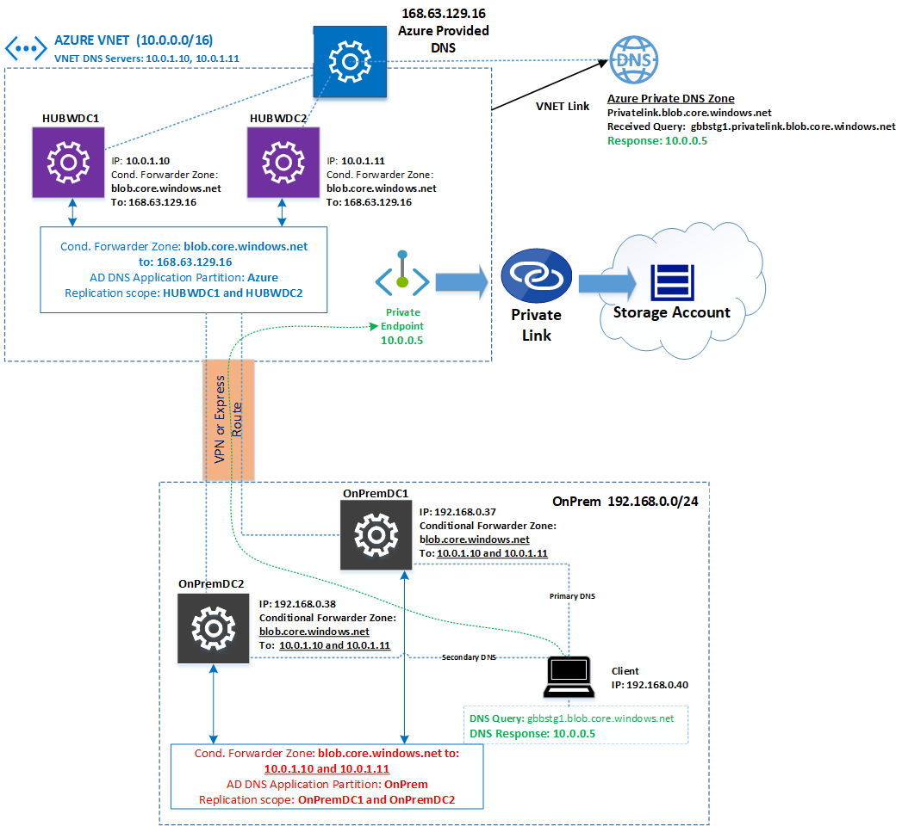
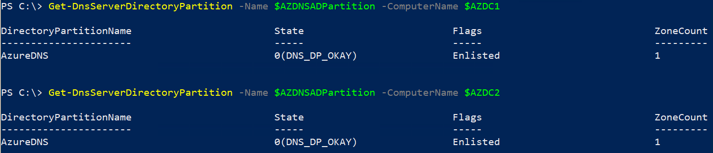
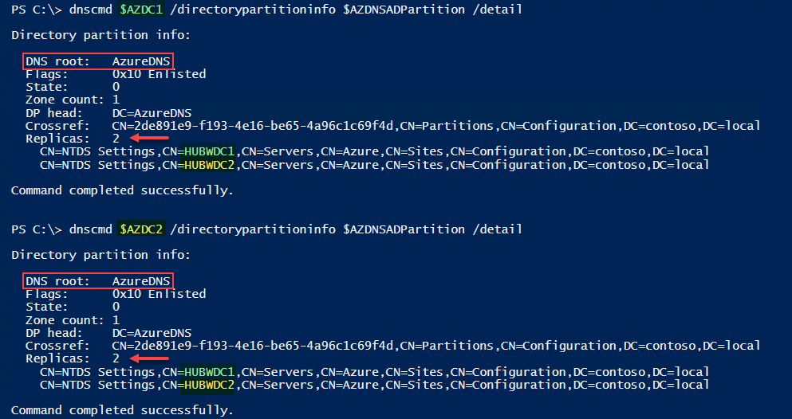
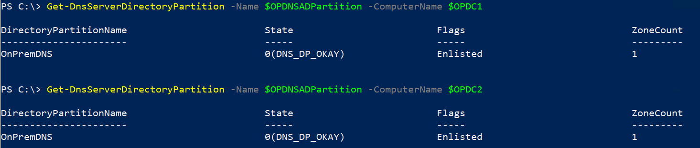
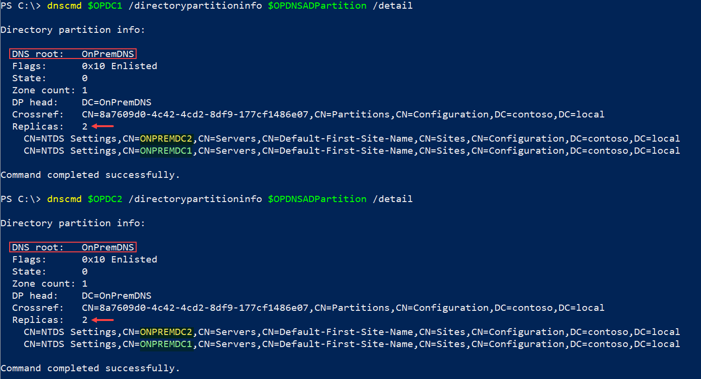
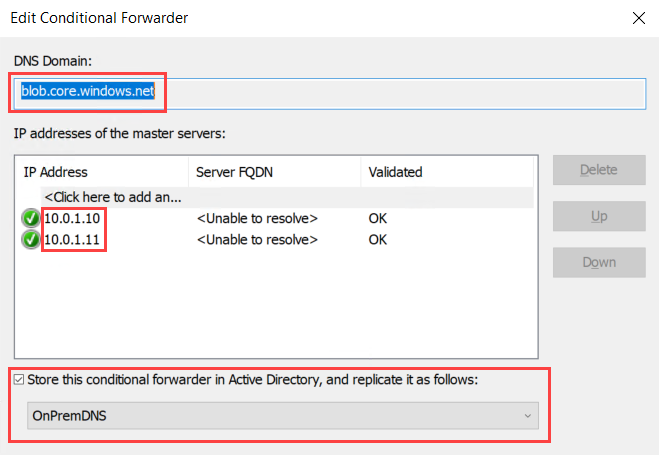
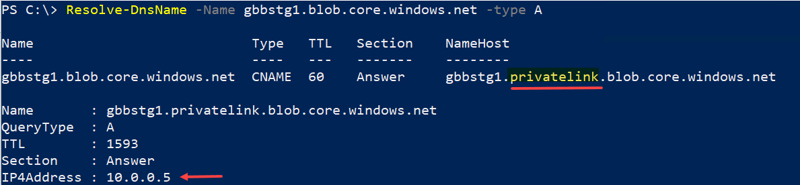

# Private Endpoint DNS integration using Active Directory

## Content
[Introduction](#introduction)

[Scenario](#scenario)

[How to deploy the solution](#how-to-deloy-the-solution)

[Azure Custom AD DNS Zone](#azure-custom-ad-dns-zone)

[On-Premises Custom AD DNS Zone](#on-premises-custom-ad-dns-zone)

[LAB](#lab)

[Closing](#closing)

## Introduction

Several companies use Active Directory (AD) as their primary authentication service. One of the core components to make AD run properly is Domain Name Services (DNS) which brings specific functionality advantages, such as a full feature DNS as well as replication of DNS zones using AD replication. Another capability of DNS in AD environments is the capability to make DNS zone application partitions which allows you to define replication scopes.

Specifically for Private Link/Endpoint integration, you need to create conditional forwarders zones in On-Premises to reach Domain Controllers in Azure, and from those reach to 168.63.129.16 (Azure Provided DNS) to consume properly Azure Private DNS zone (privatelink.blob.core.windows.net).

If you don't have a fully understanding on how Private Link/Endpoint works, it is recommended you review the article: [Private Endpoint DNS Integration Scenarios](https://github.com/dmauser/PrivateLink/tree/master/DNS-Integration-Scenarios).

## Scenario

In this scenario with Active Directory, customer wants to integrate Azure Private DNS which requires them to create a conditional forwarder zone to **blob.core.windows.net** integrated with AD. The biggest advantage this approach is customers do not require to create individual Conditional Forwarders in each Domain Controller running DNS Server. Instead, customers can create a single Conditional Forwarder Zone and integrate it with Active Directory application partition. With that integration the Conditional Forwarder zone will be replicated automatically to all Domain Controllers depending on the replication scope selected.



Download a [Visio file](https://raw.githubusercontent.com/dmauser/PrivateLink/master/DNS-Scenario-Using-AD/private-endpoint-dns-ad-integraton.vsdx) of this architecture.

:point_right: **Note 1:** This scenario takes in consideration same Active Directory Forest shared between On-Premises and Azure. This scenario is illustrated on Azure Architecture documentation as: [Extend your on-premises Active Directory domain to Azure](https://docs.microsoft.com/en-us/azure/architecture/reference-architectures/identity/adds-extend-domain).

:point_right: **Note 2:** This scenario also considers global forwarder setting on Azure DCs and OnPrem DCs point to another DNS Server (either internal or external). That configuration is not illustrated on the diagram above and assumes DNS is pointing to another IP as Global Forwarder.

## How to deploy the solution

Below is the commands used to make this solution to work on the scenario above. That will require commands to be executed at least in one Domain Controller, it does not matter if they are On-premises or in Azure.
Same blob.core.windows.net conditional forward zone will be deploy for Azure DCs and OnPrem DCs but on Azure side that will have as target 168.63.129.16 (Azure Provided DNS) while OnPrem side will have Azure DCs as targets (HUBWDC1/10.0.1.10 and HUBWDC2/10.0.1.11).

### Azure Custom AD DNS Zone

Below are the steps to deploy this solution on Azure Domain Controllers hosting conditional forwarder zone blob.core.windows.net to 168.63.129.16 (Azure Provided DNS).

1. Define Powershell variables

```Powershell
$AZDNSADPartition="AzureDNS" #Name of the AD Application Partition
$AZDC1="HUBWDC1" #DC1 in Azure
$AZDC2="HUBWDC2" #DC2 in Azure
$CFZ="blob.core.windows.net"
```

2. Create DNS Application Partition

```Powershell
Add-DnsServerDirectoryPartition -Name $AZDNSADPartition
```

3. Create Conditional Forwarder Zone integrated to AD

In this case a conditional forwarder to: blob.core.windows.net will be created and set target DNS Server 168.63.129.16 (Azure Provided DNS).

```powershell
Add-DnsServerConditionalForwarderZone -ComputerName $AZDC1 `
-Name $CFZ -ReplicationScope Custom -DirectoryPartitionName $AZDNSADPartition `
-MasterServers 168.63.129.16
```

4. Register additional domain controller (HUBWDC2) to be part of the same DNS application partition (AzureDNS). In case you have additional Azure domain controllers you can re-run same command by specifying its name.

```powershell
Register-DnsServerDirectoryPartition -Name $AZDNSADPartition -ComputerName $AZDC2
```

5. Validate both Azure DCs (HUBWDC1 and HUBWDC2) belong to AzureDNS application partition replication scope.

```Powershell
Get-DnsServerDirectoryPartition -Name $AZDNSADPartition -ComputerName $AZDC1
Get-DnsServerDirectoryPartition -Name $AZDNSADPartition -ComputerName $AZDC2
```

Expected output:

It shows both HUBWDC1 and HUBWDC2 enlisted on AzureDNS Application Partition



DNSCMD.exe command can also be used to validate if both domain controllers belong to the same application partition:

```powershell
# Output for HUBWDC1
dnscmd $AZDC1 /directorypartitioninfo $AZDNSADPartition /detail
# Output for HUBWDC2
dnscmd $AZDC2 /directorypartitioninfo $AZDNSADPartition /detail
```

Output:



At this point configured DNS Zone integrated with Active Directory show in both enlisted Azure DCs with exact same configuration. That will not be replicated down to On-Premises DCs because they will use same zone blob.core.windows.net but pointing to different IPs (Azure HUBWDC1 and HUBWDC2). On Azure DCs DNS Management console you will see conditional forwarder blob.core.windows.net using 168.63.129.16 (Azure Provided DNS).


### On-Premises Custom AD DNS Zone

Here are the steps to deploy this on On-Premises DCs hosting conditional forwarder zone blob.core.windows.net to Azure DCs (10.0.1.10 and 10.0.1.11):

1. Define Powershell variables

```Powershell
$OPDNSADPartition="OnPremDNS" #Name of the AD Application Partition
$OPDC1="ONPREMDC1" #DC1 On-Premises
$OPDC2="ONPREMDC2" #DC2 in Azure
$CFZ="blob.core.windows.net"
```

2. Create DNS Application Partition

```Powershell
Add-DnsServerDirectoryPartition -Name $OPDNSADPartition
```

3. Create Conditional Forwarder Zone integrated to AD

In this case a conditional forwarder to: blob.core.windows.net will be created and set target DNS Server 168.63.129.16 (Azure Provided DNS).

```powershell
Add-DnsServerConditionalForwarderZone -ComputerName $OPDC1 `
-Name $CFZ -ReplicationScope Custom -DirectoryPartitionName $OPDNSADPartition `
-MasterServers 10.0.1.10,10.0.1.11
 ```

4. Register additional domain controller (ONPREMDC2) to be part of the same DNS application partition (OnPremDNS). In case you have additional On-prem domain controllers you can re-run same command by specifying its name.

```powershell
Register-DnsServerDirectoryPartition -Name $OPDNSADPartition -ComputerName $OPDC2
```

5. Validate both Azure DCs (ONPREMDC1 and ONPREMDC2) belong to the same OnPrem application partition replication scope

```Powershell
Get-DnsServerDirectoryPartition -Name $OPDNSADPartition -ComputerName $OPDC1
Get-DnsServerDirectoryPartition -Name $OPDNSADPartition -ComputerName $OPDC2
```

Expected output:

It shows both ONPREMDC1 and ONPREMDC2 enlisted on AzureDNS Application Partition



DNSCMD.exe command can also be used to validate if both domain controllers belong to the same application partition:

```powershell
# Output for OnpremDC1
dnscmd $OPDC1 /directorypartitioninfo $OPDNSADPartition /detail
# Output for OnpremDC2
dnscmd $OPDC2 /directorypartitioninfo $OPDNSADPartition /detail
```

Output:



On On-premises DCs DNS Management console you will see conditional forwarder blob.core.windows.net using 10.0.1.10 and 10.0.1.11 (Azure DCs HUBWDC1 and HUBWDC2)



## Final DNS validation (Private Endpoint)

As final step for this validation below we have a full name resolution to resolve storage account name from Azure as well as from On-premises:



## LAB

A template or script to practice this deployment will be included soon. At this time deploy two VNETs (one to simulate On-premises and another to simulate Azure).

- Define On-premises Virtual Network with address space 192.168.0.0/24
    - Configure DNS to use 192.168.0.37 and 192.168.0.38.
- Define Azure Virtual Network with address space space 10.0.0.0/16
    - Configure VNET DNS Settings to use 10.0.1.10 and 10.0.1.11.
- Create a VNET Peering or Virtual Network Gateway in each VNET and connect them.
- Install two VMs on each VNET with respective static IP 
    - OnPremDC1(192.168.0.37), OnPremDC2(192.168.0.38), HUBWDC1(10.0.1.10) and HUBWDC2(10.0.1.11).
- Configure Active Directory single forest and promote all of VMs as Domain Controllers.

## Closing

Thanks for Azure Networking GBB Team and special thanks for Microsoft FTE Clive Graven for collaboration on this content.

Other relevant resources can be found in [Private Link/Endpoint DNS Integration Resources](https://github.com/dmauser/PrivateLink).