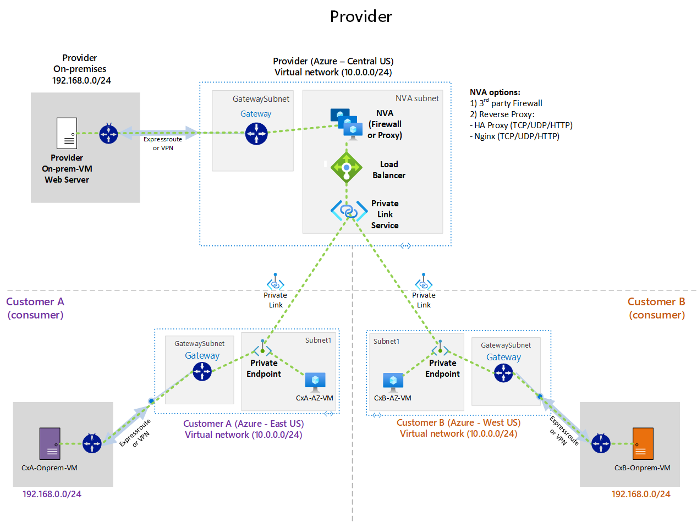
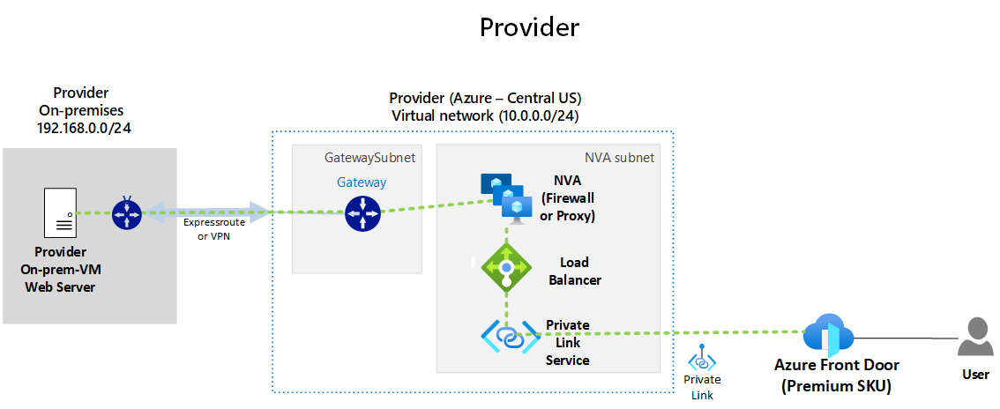

# Using Private Link Service for On-premises workloads

**Contents**

[Use case](#Usecase)

[Architecture diagram](#Architecture-diagram)

[Concepts](#Concepts)

[Firewall and proxy considerations](#Firewall-and-proxy-considerations)

[Azure Front Door](#Azure-Front-Door)

[Lab this solution](#Lab-this-solution)

## Use case

There is an increased customer demand for Private Link to consume several PaaS services that have onboarded that feature. On the other hand, mostly due to the popularity of Private Link, other scenarios have emerged where Azure customers want to publish their services to be consumed by other Azure customers. For that approach, there's a feature called Private Link Service (also known as exposing your own service so others can connect).

To leverage Private Link Service as a service provider, it is necessary to have your workloads to be placed behind an Azure Standard Load balancer (either public or internal) and have your virtual machine or scale set attached to it. Also, you have to create a Private Link Service and associate it to the Load Balancer front-end IP. For more information consult [What is Azure Private Link service?](https://docs.microsoft.com/en-us/azure/private-link/private-link-service-overview). Consumers of the service who are customers and also present in Azure, have to create a Private Endpoint to be able to access published services that providers made available over Private Link Service.

The main solution referred by Microsoft documentation expects that provider's workloads to be published is present in Azure, more specifically in Azure Virtual Network. The question that remains and the main focus of this article is **how about On-premises workloads** like a Database or Web servers have that same capability to be offered over Private link service to other consumers privately using Azure?  That is exactly the scope of this post is to give customers the flexibility to also offer workloads outside of the Azure Virtual Network, like when they reside On-premises, to be consumed by other Azure customers (consumers).

It is important to keep in mind that there are several reasons customers may not be able to move their resources to Azure, to enumerate a few of them listed here but not limited to:

1. Regulatory constraints that dictate that data must be stored On-premises.
2. Application design requirements like legacy applications that are not ready to be modernized or moved to the Cloud.
3. Infrastructure constraints where data has better performance being accessed from On-premises.
4. Costs to bring data from Cloud to On-premises like a database replication may incur egress costs.

## Architecture diagram

The architecture diagram below shows a Provider that has a Web Server on their On-premises network and wants to allow Customer A and Customer B to access it privately using Azure infrastructure.

_Download a Visio [file](./PLS-on-prem-workloads.vsdx) of this architecture and use Layers to add or remove components._

## Concepts

There are some important benefits of this solution as well as some requirements to make this solution work properly. First, here are some benefits of using Private Link Service to publish On-premises workloads:

1. Provider and consumer can be in **different subscriptions/tenants**.
2. It works for **TCP and UDP** protocols.
3. Provider and consumer can have **overlapping IPs** (as shown on the architecture diagram all parties have the same IP scheme).
4. Application is privately published over Azure (requires all parties have Azure Subscriptions). **Remove the need to build and manage complex VPN connections** that are commonly used on this type of consumer/provider interconnection.
5. **There are not constraints of the presence of the provider and consumer over the Azure regions** (on the diagram above the provider is on Azure US Central, while consumers Customer A and Customer B are in different Azure regions, Azure East US on West US respectively).
6. **Provider's published on-premises workload** via PLS **can also be accessible** not just from the customers' Azure networks via Private Endpoint but also **from their on-premises networks** either by VPN or ExpressRoute connection.

Second, here is a breakdown of requirements from Providers and Consumers:

### Provider

- Azure Load Balancer Standard SKU (Public or internal).
- Private Link Service (PLS).
- NVA (network virtual appliances) such as Firewalls, Reverse Proxy products like Nginx or HA Proxy.
- Approval of Private Endpoint request (private link) to allow a consumer to access published application over PLS.

### Consumer

- Obtain the Private Link Service ID (resource ID or alias) from Provider.
- Azure Private Endpoint using a customer's VNET private IP.
- Proper DNS configuration to resolve Private Endpoint IP (optional).

## Firewall and proxy considerations

On the provider side, it will be important to identify the correct device to redirect traffic to reach on-premises workloads. There are a few considerations on each one of the following solutions:

### Firewall

- Firewall must have the ability to do destination NAT (DNAT).
- It is mostly layer 4 and can reach on-premises resources using TCP or UDP protocols.
- On-premises workload will see Private Link Service (PLS) NAT IP as source IP.

### Reverse Proxy

- It can be used for TCP and UDP mostly but has some extra features to HTTP workloads.
- It can be configured to use TCP Proxy 2.0 to show real consumer IP.
- Solutions like Nginx and HA Proxy give you the flexibility to use UDP and TCP forwarders as well as HTTP with specific features such as X-Forwarded-For header.
- On-premises workload will see Proxy IP as source IP but application level can be customized to use either TCP Proxy 2.0 to give visibility of the real consumer IP. For more information consult: [Getting connection Information using TCP Proxy v2](https://docs.microsoft.com/en-us/azure/private-link/private-link-service-overview#getting-connection-information-using-tcp-proxy-v2).

## Azure Front Door

Another capability customers can leverage from this solution is to use Azure Front Door Premium SKU to publish their On-premises Web applications to the Internet via Azure. That allows customers to have their web application ready to be scaled globally by taking advantage of application acceleration such as caching of web application content over hundreds of [Microsoft Content Delivery Network Points-of-presence (CDN PoPs)](https://docs.microsoft.com/en-us/azure/cdn/cdn-pop-locations) as well as enforce Web Application Security (WAF) to properly secure it.

## Lab this solution

You can lab this solution fully and test all moving parts by leveraging the following lab guides.

- [Using Private Link Service to publish On-premises workloads by using HAProxy](https://github.com/dmauser/Lab/tree/master/PLS-for-onprem-workloads-haproxy)
- Using Private Link Service to publish On-premises workloads by using 3rd Party NVA (coming soon)
- Using Private Link Service to publish On-premises workloads by using Azure Front Door (coming soon)
